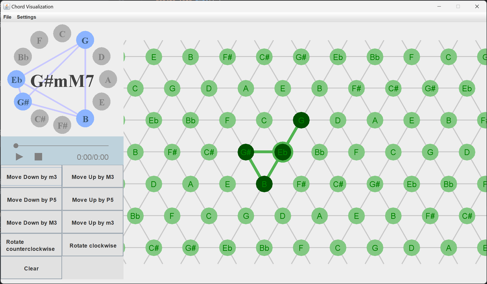
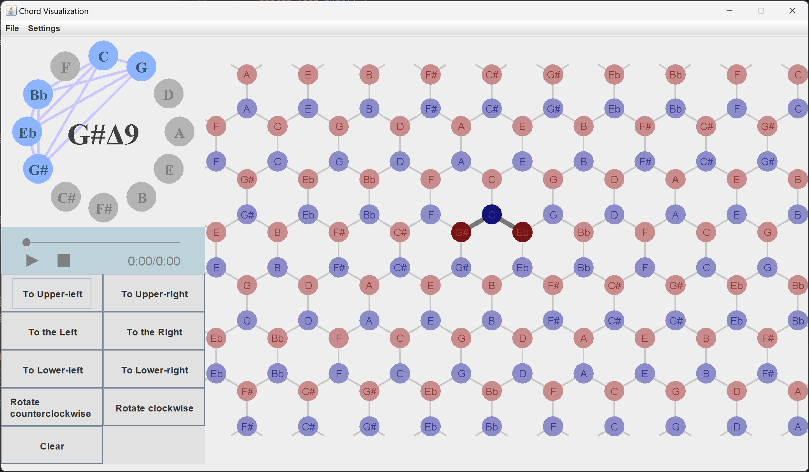
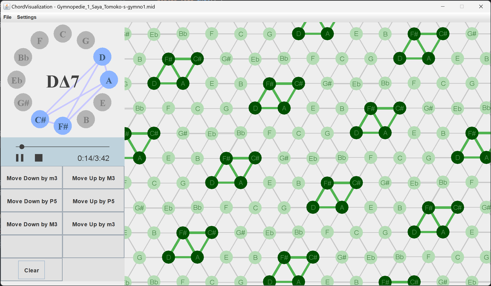

# Chord Visualization

This is a application intended to help chord progression design. It allows users to:

- Create and operate chords on its graphical interface. 
- Play MIDI files. The application also visualizes music on its GUI.

## How does the visualization work

There are three forms of visualization in this program.

- **Tonnetz:** The panel on the right-hand side shows a Tonnetz structure. In this structure, two notes are connected when they form m3, M3 or P5 interval. Both cylinder (finite) and torus (infinite) version of Tonnetz are available. Visit https://en.wikipedia.org/wiki/Tonnetz to learn more.

*Tonnetz*

*Infinite Tonnetz*

- **Circle of fifths:** The panel on the left-hand side shows a circle of fifths. Each node here represents a pitch class, and forms P5 with any of their neighbors. Learn more on https://en.wikipedia.org/wiki/Circle_of_fifths. The panel also classifies current chord in an out-of-context manner.
- **Dual-Tonnetz:** Use the settings menu to switch to the dual graph of the Tonnetz, where red and blue nodes represents major and minor triads respectively. Two triads are connected when they share 2 common notes.

*Dual-Tonnetz*

## Usage

Left click on notes to press. Use the control panel to apply operations to the pressed notes. These operations are:

- **Moving along edges:** On Tonnetz this means parallel movement by P5, M3 or m3 interval. On Dual-Tonnetz things are more interesting since chord structures change as they travel. 
- **Rotation:** Rotate all notes according to the rotation center. Right click to set rotation center. This operation is only supported on the cylindrical Tonnetz, and is only well-defined locally. It behaves in unexpected ways when the note group is too large, or when it touches right/left boundary of the Tonnetz. You can see the note group "converging" into a local chart of cylinder as you apply rotations, which I personally find very interesting.

Use settings menu to switch between different Tonnetze or change instrument.

Use file menu to play MIDI files. An example "Gymnopedie_1_Saya_Tomoko-s-gymno1.mid" can be found in the examples folder, which I retrieved from https://www-personal.umich.edu/~bbowman/midi/satie/index.html.

*MIDI player*